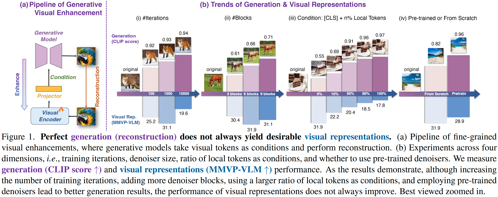

# Imperfect Generative Models are Secretly Strong Vision-Centric Enhancers

**[Shijie Ma<sup>1,2</sup>](https://mashijie1028.github.io/), 
[Yuying Ge<sup>1 &#9993;</sup>](https://geyuying.github.io/), 
[Teng Wang<sup>1</sup>](http://ttengwang.com/), 
[Yuxin Guo<sup>1,2</sup>](https://scholar.google.com/citations?user=x_0spxgAAAAJ&hl=en), 
[Yixiao Ge<sup>1</sup>](https://geyixiao.com/), 
[Ying Shan<sup>1</sup>](https://scholar.google.com/citations?user=4oXBp9UAAAAJ&hl=en)**
<br>
<sup>1</sup>ARC Lab, Tencent PCG
<sup>2</sup>Institute of Automation, CAS
<br>

<a href='https://arxiv.org/abs/2403.04272'></a> 
<a href='https://mashijie1028.github.io/gen4rep/'></a>
<a href='https://huggingface.co/msj9817/Gen4Rep/'></a>


## Introduction

Recent works demonstrate the feasibility of enhancing visual representations with generative models, where generative models take visual tokens as conditions and perform reconstruction. However, the underlying principle remains underexplored.

We empirically reveal that perfect generation (reconstruction) does not always yield desirable visual representasions, as shown below:



In this work, we delve into three aspects to explore the critical factors: (1) conditioning mechanisms, (2) denoising configurations and (3) generation paradigms.

We propose a two-stage post-training method to enhance CLIP ViT's fine-grained visual representations, which is efficient (with only lightweight denoisers) and versatile (applicable to both continuous and discrete denoisers). The pipeline of our method is illustrated below:


## News

* [2025-03-24] Release evaluation codes.
* [2025-03-24] Release models weights on [Huggingface🤗](https://huggingface.co/msj9817/Gen4Rep/).
* [2025-03-24] Release the [project page](https://mashijie1028.github.io/gen4rep/) of this repo.


## TODOs

- [ ] Release training code of continuous denoisers.
- [ ] Release training code of discrete denoisers.


## Acknowledgements

When building the codebase of continuous denosiers, we refer to [x-flux](https://github.com/XLabs-AI/x-flux). Thanks for their wonderful project. Notably, we do NOT use their pre-trained weights.


## License

This repository is under the [Apache 2 License](https://github.com/mashijie1028/Gen4Rep/blob/main/LICENSE).


## BibTeX

```
@article{ma2025genrep,
      title={Imperfect Generative Models are Secretly Strong Vision-Centric Enhancers},
      author={Ma, Shijie and Ge, Yuying and Wang, Teng and Guo, Yuxin and Ge, Yixiao and Shan, Ying},
      journal={arXiv preprint arXiv:2503.TODO},
      year={2025}
}
```


## Contact

If you have further questions, feel free to contact me: mashijie9817@gmail.com

Discussions and potential collaborations are also welcome.